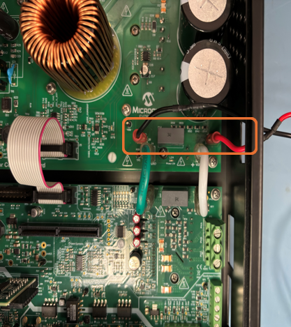
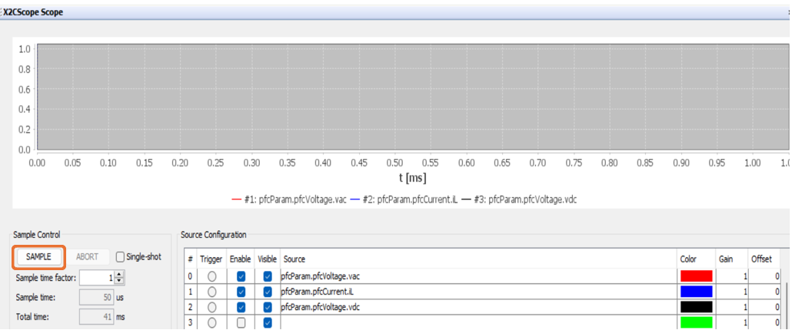

 
## Single-Stage Boost Power Factor Correction Demonstration: MCHV-230VAC-1.5kW and dsPIC33CK64MC105 Motor Control DIM

## 1. INTRODUCTION
This document describes the setup requirements for single-stage boost power factor correction algorithm on the hardware platform [EV78U65A](https://www.microchip.com/en-us/development-tool/ev78u65a) "MCHV-230VAC-1.5kW Development Board"  and [EV03J37A](https://www.microchip.com/en-us/development-tool/ev03j37a) "dsPIC33CK64MC105 Motor Control Dual In-line Module (DIM)".
 

## 2. SUGGESTED DEMONSTRATION REQUIREMENTS

### 2.1 PFC Application Firmware Required for the Demonstration

To clone or download this application firmware on GitHub, 
- Navigate to the [main page of this repository](https://github.com/microchip-pic-avr-solutions/mchv230vac1.5kw-33ck64mc105-pfc) and 
- On the tab **<> Code**, above the list of files in the right-hand corner, click Code, then from the menu, click <b>Download ZIP</b> or copy the repository URL to **clone.**
> **Note:** 
>In this document, hereinafter this firmware package is referred as **firmware.**
### 2.2 Software Tools Used for Testing the firmware

- MPLAB® X IDE **v6.20** 
- DFP: **dsPIC33CK-MC_DFP v1.7.244**
- Curiosity/Starter Kits Tool Pack : **PKOB4_TP v1.16.1230**
- MPLAB® XC-DSC Compiler **v3.10**
- MPLAB® X IDE Plugin: **X2C-Scope v1.6.6**
> **Note:**  
>The software used for testing the firmware prior to release is listed above. It is recommended to use the version listed above or later versions for building the firmware.All previous versions of Device Family Packs (DFP) and Tool Packs can be downloaded from [Microchip Packs Repository.](https://packs.download.microchip.com/)
### 2.3 Hardware Tools Required for the Demonstration

- MCHV-230VAC-1.5kW Development Board [(EV78U65A)](https://www.microchip.com/en-us/development-tool/ev78u65a)
- dsPIC33CK64MC105 Motor Control Dual In-line Module [(EV03J37A)](https://www.microchip.com/en-us/development-tool/ev03j37a)
- AC Source for powering the Development Board: 150-230Vac rms , 50Hz
- Bulb load

> **Note:**  
>  Items [EV78U65A](https://www.microchip.com/en-us/development-tool/ev78u65a) and [EV03J37A](https://www.microchip.com/en-us/development-tool/ev03j37a) are available to purchase directly from [microchip DIRECT](https://www.microchipdirect.com/) 
 

## 3. HARDWARE SETUP
This section describes the hardware setup required for the demonstration.
Refer ["Motor Control High Voltage 230VAC-1.5kW Development Board User's Guide"](https://ww1.microchip.com/downloads/aemDocuments/documents/MCU16/ProductDocuments/UserGuides/Motor-Control-High-Voltage-230VAC-1.5kW-Dev-Board-Users-Guide-DS70005576.pdf), before operating the unit.
> **Note:**  
>In this document, hereinafter the MCHV-230VAC-1.5kW Development Board is referred as **development board**.

1. Ensure the development board is not powered and it is fully discharged. Verify the LEDs **LD1**(Green) and **LD4**(Red) on Power Factor Correction Board and **LD1**(Green) on Motor Control Inverter Board are not glowing. 

     

     

2. Remove the thumb screw and open the top cover of the enclosure and measure the DC Bus voltage across the terminals which reads approximately '0 VDC'. If the voltage is greater than 1V, wait until it is completely discharged.

3. Connect the positive terminal of the bulb load to connector J3 and the negative terminal to connector J8 provided on the development Board.

     

     

4. Insert the **dsPIC33CK64MC105 Motor Control DIM** into the DIM Interface **connector J2** on the development board. Make sure the DIM is placed correctly and oriented before going ahead. Close the top cover of the enclosure and secure it with the thumb screw.

     

     

5. Power the PFC board using a controlled AC source by applying a voltage within in the range 150-240Vac rms and a frequency of 50Hz through IEC connector **connector J1** provided on the PFC board. If the supply frequency is 60Hz, refer to point No: 3 in the section [Basic Demonstration](#52-basic-demonstration) to change the input frequency in firmware parameters . 

      

      

> **Note:**  
>The Development Board is designed to operate in the 90 to 230Vac rms voltage range with a maximum input current of 10Arms. In the Input AC voltage range of 90 to 150Vac rms, the maximum input power to the Development Board must be derated (<1500W) to maintain the input current through the socket to less than or equal to 10Arms.

6. The Development Board has an on-board programming tool called the Isolated PKoB4 Daughter Board. To use the on-board programmer, connect a micro-USB cable between the Host PC and connector J11(**PROGRAM**) on the development board.
      

      

> **Note:**  
> Use only **shielded micro-USB** cables intended for data transfer.

 7. To establish serial communication with the host PC, connect a micro-USB cable between the host PC and connector J8(**USB-UART**) on the development board. 
      

      

 
  

## 4. SOFTWARE SETUP AND RUN
### 4.1 Setup: MPLAB X IDE and MPLAB XC-DSC Compiler
Install **MPLAB X IDE** and **MPLAB XC-DSC Compiler** versions that support the device **dsPIC33CK64MC105** and **PKOBv4.** The MPLAB X IDE, MPLAB XC-DSC Compiler, and X2C-Scope plug-in used for testing the firmware are mentioned in the [PFC Application Firmware Required for the Demonstration](#21-pfc-application-firmware-required-for-the-demonstration) section. 

To get help on  

- MPLAB X IDE installation, refer [link](https://microchipdeveloper.com/mplabx:installation)
- MPLAB XC-DSC Compiler installation steps, refer [link](https://developerhelp.microchip.com/xwiki/bin/view/software-tools/xc-dsc/install/)

If MPLAB IDE v8 or earlier is already installed on your computer, then run the MPLAB driver switcher (Installed when MPLAB®X IDE is installed) to switch from MPLAB IDE v8 drivers to MPLAB X IDE drivers. If you have Windows 8 or 10, you must run the MPLAB driver switcher in **Administrator Mode**. To run the Device Driver Switcher GUI application as administrator, right-click on the executable (or desktop icon) and select **Run as Administrator**. For more details, refer to the MPLAB X IDE help topic **“Before You Begin: Install the USB Device Drivers (For Hardware Tools): USB Driver Installation for Windows Operating Systems.”**

### 4.2 Setup: X2C-SCOPE
X2C-Scope is a MPLAB X IDE plugin that allows developers to interact with an application while it runs. X2C-Scope enables you to read, write, and plot global variables (for motor control) in real-time. It communicates with the target using the UART. To use X2C-Scope, the plugin must be installed. To set up and use X2C-Scope, refer to the instructions provided on the [web page](https://x2cscope.github.io/docs/MPLABX_Plugin.html).

## 5.  BASIC DEMONSTRATION
### 5.1 Firmware Description
The firmware version needed for the demonstration is mentioned in the section [PFC Application Firmware Required for the Demonstration](#21-pfc-application-firmware-required-for-the-demonstration) section. This firmware is implemented to work on Microchip’s 16-bit Digital signal controller (dsPIC® DSC) **dsPIC33CK64MC105**. For more information, see the **dsPIC33CK64MC105 Family datasheet ([DS70005399](https://ww1.microchip.com/downloads/aemDocuments/documents/MCU16/ProductDocuments/DataSheets/dsPIC33CK64MC105-Family-Data-Sheet-DS70005399D.pdf))**.

> **Note:** 
> The project may not build correctly in Windows OS if the Maximum path length of any source file in the project is more than 260 characters. In case the absolute path exceeds or nears the maximum length, do any (or both) of the following:
> - Shorten the directory name containing the firmware used in this demonstration. If you renamed the directory, consider the new name while reading the instructions provided in the upcoming sections of the document.
> - Place firmware in a location such that the total path length of each file included in the projects does not exceed the Maximum Path length specified.  
> Refer to MPLAB X IDE help topic **“Path, File, and Folder Name Restrictions”** for details. 

### 5.2 Basic Demonstration
Follow the below instructions, step by step, to set up and run the PFC demo application:

1. Start **MPLAB X IDE** and open the project **pfc.X (File > Open Project)** with device selection **dsPIC33CK64MC105.**   
     

     
 

2. Set the project **pfc.X** as the main project by right-clicking on the project name and selecting **Set as Main Project** as shown. The project **pfc.X** will then appear in **bold**.    
     

     

	
3. Open <code>**pfc_userparams.h** </code> (**pfc.X > Header Files> pfc**) in the project **pfc.X.**  
     - Ensure that the macro <code>**DEBUG_BOOST**</code> is not defined.        

          

          

          
     - Ensure that the macro <code><b>PFC_POWER_CONTROL</b></code> is defined.

          

          

     
     - Update the input supply frequency by setting the macro <code>**PFC_INPUT_FREQUENCY**</code>.

          

          

4. Right-click on the project **pfc.X** and select **Properties** to open its **Project Properties** Dialog. Click the **Conf:[default]** category to reveal the general project configuration information. The development tools used for testing the firmware are listed in section [2.2 Software Tools Used for Testing the firmware](#22-software-tools-used-for-testing-the-firmware)

     In the **Conf:[default]** category window: 
     - Ensure the selected **Device** is **dsPIC33CK64MC105.**
     - Select the **Connected Hardware Tool** to be used for programming and debugging. 
     - Select the specific Device Family Pack (DFP) from the available list of **Packs.** In this case, **dsPIC33CK-MC_DFP 1.7.244** is selected. 
     - Select the specific **Compiler Toolchain** from the available list of **XC-DSC** compilers. 
     In this case, **XC-DSC Compiler v3.10** is selected.
     - After selecting Hardware Tool and Compiler Toolchain, Device Pack, click the button **Apply**.

     - Please ensure that the selected MPLAB® XC-DSC Compiler and Device Pack support the device configured in the firmware.

          

          

  

5. Ensure that the checkbox **Load symbols when programming or building for production (slows process)** is checked under the **Loading** category of the **Project Properties** window.              
     

     

     Also, go to **Tools > Options** , and
           
      

      

      
    Open the  **Embedded > Generic Settings** tab and ensure that the **ELF debug session symbol load methodology (MIPS/ARM)** is selected as **Pre-procesed (Legacy)** from the drop down.
           
      

      

6. To build the project (in this case, **pfc.X**) and program the device dsPIC33CK64MC105, click **Make and Program Device Main project** on the toolbar
     

     
 

7. If the device is successfully programmed,**LED1(D15)** will be **blinking**, indicating that the dsPIC® DSC is enabled.
    

     

8. Measure the DC Bus voltage across the terminals (**VDC** and **PGND**) and ensure that the voltage is approximately 380V, as specified by the macro <code>**PFC_OUPUT_VOLTAGE_NOMINAL**</code> in the **pfc_userparams.h** file. 
    

     

> **Note:** 
> Please refer to the Board Inspection Checklist section in the Motor Control High Voltage 230VAC-1.5kW Development Board User’s Guide [(DS70005576)](https://ww1.microchip.com/downloads/aemDocuments/documents/MCU16/ProductDocuments/UserGuides/Motor-Control-High-Voltage-230VAC-1.5kW-Dev-Board-Users-Guide-DS70005576.pdf)
to verify the power supply outputs of the Development Board when a functional failure is suspected or observed.

## 5.3  Data visualization through X2C-Scope Plug-in of MPLAB X

X2C-Scope is a third-party plug-in in MPLAB X, which helps in real-time diagnostics. The application firmware comes with the initialization needed to interface the controller with the host PC to enable data visualization through the X2C-Scope plug-in. Ensure the X2C-Scope plug-in is installed. For more information on how to set up a plug-in, refer to either the [Microchip Developer Help page](https://microchipdeveloper.com/mplabx:tools-plugins-available) or the [web page.](https://x2cscope.github.io/docs/MPLABX_Plugin.html)
 
1. To establish serial communication with the host PC, connect a micro-USB cable between the host PC and connector J8 **(USB-UART)** on the development board. This interface provides an isolated USB-UART communication.

2. Ensure the application is configured and running as described under section [5.2 Basic Demonstration](#52-basic-demonstration) by following steps 1 through 8.

3. Open the **X2C-Scope** window by selecting **Tools>Embedded>X2CScope.**
     

     

4. **In the X2C-Scope Configuration** window, open the **Connection Setup** tab and click **Select Project.** This opens the drop-down menu **Select Project** with a list of opened projects. Select the specific project **pfc** from the list of projects and click **OK**.    
    

    

5. To configure and establish the serial communication for **X2C-Scope**, open the **X2CScope Configuration** window, click on the **Connection Setup** tab and:
     - Set **Baudrate** as **115200**, which is configured in the application firmware. 
     - Click on the **Refresh** button to refresh and update the list of the available Serial COM ports connected to the Host PC. 
     - Select the specific **Serial port** detected when interfaced with the development board. The **Serial port** depends on the system settings
          

          

 
6. Once the **Serial port** is detected, click on **Disconnected** and turn to **Connected**, to establish serial communication between the Host PC and the board.
     

     

7. Open the **Project Setup** tab in the **X2CScope Configuration** window and,
     - Set **Scope Sampletime** as the interval at which <code>X2CScopeUpdate()</code> is called. In this application, it is every <code>50µs.</code> 
     - Then, click **Set Values** to save the configuration.
          

          

8. Click on **Open Scope View** (in the **Data Views** tab of the **X2CScope Configuration** Window) this opens **Scope Window.**
     

     

    	     
9. In the **Scope Window**, select the variables that must be watched. To do this, click on the **Source** against each channel, and a window **Select Variables** opens on the screen. From the available list, the required variable can be chosen. Ensure checkboxes **Enable** and **Visible** are checked for the variables to be plotted.
To view data plots continuously, uncheck **Single-shot.** When **Single-shot** is checked, it captures the data once and stops. The **Sample time factor** value multiplied by **Sample time** decides the time difference between any two consecutive data points on the plot.
    

    

10.	Click on **SAMPLE**, then the X2C-Scope window plots variables in real-time, which updates automatically.
     

     

 

11.	Click on **ABORT** to stop.
     

     

 
 ## 6. REFERENCES:
For additional information, refer following documents or links.
1. AN1106 Application Note “[Power Factor Correction in Power Conversion Applications
Using the dsPIC® DSC](https://ww1.microchip.com/downloads/en/Appnotes/01106A.pdf)”
2. Motor Control High Voltage 230VAC-1.5kW Development Board User’s Guide [(DS70005576)](https://ww1.microchip.com/downloads/aemDocuments/documents/MCU16/ProductDocuments/UserGuides/Motor-Control-High-Voltage-230VAC-1.5kW-Dev-Board-Users-Guide-DS70005576.pdf)
3. dsPIC33CK64MC105 Motor Control Dual In-Line Module (DIM) Information Sheet [(DS50003344)](https://ww1.microchip.com/downloads/aemDocuments/documents/MCU16/ProductDocuments/InformationSheet/dsPIC33CK64MC105-Motor-Control-DIM-Info-Sheet-DS50003344.pdf)
4. dsPIC33CK64MC105 Family datasheet [(DS70005399D)](https://ww1.microchip.com/downloads/aemDocuments/documents/MCU16/ProductDocuments/DataSheets/dsPIC33CK64MC105-Family-Data-Sheet-DS70005399D.pdf)
5. MPLAB® X IDE User’s Guide [(DS50002027)](https://ww1.microchip.com/downloads/en/DeviceDoc/50002027E.pdf) or [MPLAB® X IDE help](https://microchipdeveloper.com/xwiki/bin/view/software-tools/x/)
6. [MPLAB® X IDE installation](http://microchipdeveloper.com/mplabx:installation)
7. [MPLAB® XC-DSC Compiler installation](https://developerhelp.microchip.com/xwiki/bin/view/software-tools/xc-dsc/install/)
8. [Installation and setup of X2Cscope plugin for MPLAB X](https://x2cscope.github.io/docs/MPLABX_Plugin.html)
9. [Microchip Packs Repository](https://packs.download.microchip.com/)

